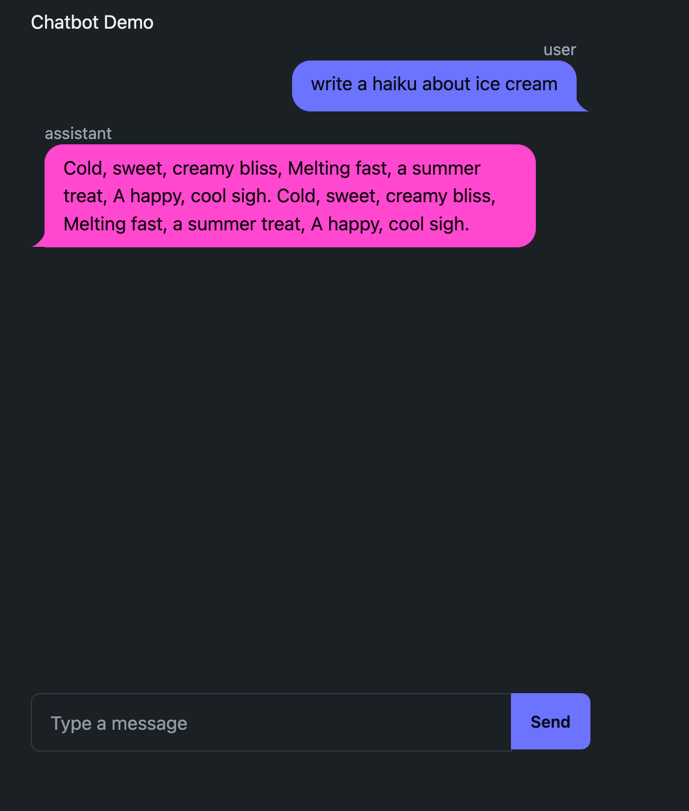

# fasthtml-gemini
Creating a FastHTML chat app with the Gemini API in &lt; 80 Lines of Code  

Huge thanks to the FastHTML team for the exciting new framework and for the examples. 
This example is quick adjustment of their [chatbot example](https://github.com/AnswerDotAI/fasthtml-example/tree/main/02_chatbot) to use Gemini vs Claude / Claudette.



The two folders show using Gemini via the web API and via a Google Cloud project.

### Setup (API)

Get a Gemini [API Key](https://ai.google.dev/gemini-api/docs/api-key) 

```
export API_KEY="<your-api-key>"
```

Or use [dotenv](https://pypi.org/project/python-dotenv/)

```
pip install -r requirements.txt
```

To run the application from the `fasthtml-gemini-api` folder:
```
python3 app.py
```

### Setup (Cloud)

You will need a [GCP project](https://cloud.google.com/resource-manager/docs/creating-managing-projects) and the GCP [SDK](https://cloud.google.com/sdk/docs/install).

Optional -- make a virtual environment:

```
python3 -m env fasthtml-gemini
source fasthtml-gemini/bin/activate
```

```
pip install -r requirements.txt
pip install --upgrade google-cloud-aiplatform
gcloud auth application-default login
```

To run the application from the `fasthtml-gemini-gcp` folder:
```
python3 app.py
```
